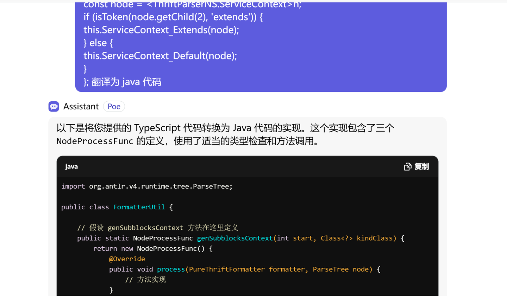

马上就是 2024 最后一天了，我想还是写点东西给 2024 留个纪念吧，免得又是悄悄度过了一个没有记住的年份。

写一下自己在工作之外写的一些代码，算是在这个世界做了一点有意义的事。

主要是两个方向。

## Go Linter

起源还是在工作中发现了自己或别人犯的一些小错误，感觉是一些常见的模式，就想实践了一下，看看能不能检测出这类错误，避免再次踩坑。

创建了一个非正式的仓库 [sundrylint](https://github.com/alingse/sundrylint) ，我的一些 idea 会先粗略的在这个里面实现，如果有比较不错的，就会单独提出去。

实现和未实现的 idea 都列在仓库下面的[#issues/2](https://github.com/alingse/sundrylint/issues/2) 里面了。

主要是如下几类错误

### 1. time.Parse 的参数顺序

```go
func demo() {
_, _ = time.Parse(time.DateOnly, date)
_, _ = time.Parse(date, time.DateOnly) // 错误的用法
}

// time.Parse 的签名
func Parse(layout, value string) (Time, error) {
}
```

Parse 函数的第一个参数是 layout, 第二个参数才是 value，因为两个都是 string，这个函数的签名是很容易混淆的。

补充了检查代码，跑了一下排名前1万的 golang 仓库，却只发现了2个错误（记录在 [#issues/3](https://github.com/alingse/sundrylint/issues/3)），事实说明大多数人没用错。所以最终这个 idea 暂时搁置了。

### 2. RangeAppendAll 的误用

这也是一个很常见的错误，在我们的项目里埋伏了2年才被发现。

```go
func collectBigger(ns []int, k int) []int {
	rs := make([]int, 0)
	for _, n := range ns {
		if n > k {
			rs = append(rs, ns...) // want `append all its data while range it`
		}
	}
	return rs
}
```

这里明显在遍历一个 slice的时候，并且在往另外一个slice里面 append 的话，大多数情况是 append 当前的那个单个元素，而不会是把这个 slice 再次全部 append 一下，这会造成元素重复。（当然，也有特殊情况就是要这么做）

这里我们发现了有5个仓库有这种情况（记录在 [#issues/3](https://github.com/alingse/sundrylint/issues/3)），当然实际应该更多。

考虑了这个逻辑不太值得一个新的 linter 来做这种事，我把这个检查提交给了 [go-critic #pull/1423](https://github.com/go-critic/go-critic/pull/1423) , 异常顺利地合并了。

### 3. nilnesserr 返回了一个一定为nil 的error

这个是隔壁部门的一个错误，还是同事眼尖发现的。大概是这样的

```go
func call() error {
    err := do()
    if err != nil {
        return err
    }
    err2 := do2()
    if err2 != nil {
        return err           // 这里 err 一定是 nil，这种是不符合预期的
        // 实际代码里面是 return errors.Wrap(err) 的形式，但这种方式目前我还没有补充，TODO 2025 :)
    }
}
```

这里在判断 err2 != nil 的时候，可能是顺手也可能是 IDE 自动提示，最终直接 return err，而err在上面已经被判断过了，这里一定是 nil，这种方式一定有问题。但是从代码 review 上来说，却很难发现。

发现这个 case 之后，一直在惦记这个东西，在想怎么识别  ，有一天突然心血来潮，问了ai，他推荐了一个 [nilness](https://cs.opensource.google/go/x/tools/+refs/tags/v0.28.0:go/analysis/passes/nilness/nilness.go) 的 linter ，还有另外一个 [nilerr](https://github.com/gostaticanalysis/nilerr) 的 linter，但是他生成的代码却是根本不能用的，只好自己手动写。

第一版写完，跑了top 2000 的 golang 仓库，得到了 75 个real bugs 和 36 个 false-positive （记录在 [sundrylint #issues/4](https://github.com/alingse/sundrylint/issues/4) 和 [nilnesserr #issues/2](https://github.com/alingse/nilnesserr/issues/2) 里面，感兴趣可以给他们修一修）

修完所有false-positive之后

最终成品： https://github.com/alingse/nilnesserr

也合并进了 [golangci-lint PR #5240](https://github.com/golangci/golangci-lint/pull/5240)  1.63.0 就可以用了。

这个我还是很开心的  ，特别是给 [delve](https://github.com/go-delve/delve/pull/3886)  和 [kubernetes](https://github.com/kubernetes/kubernetes/pull/129251) 也提了修复 PR（虽然毫无卵用）

### 4. go-linter-runner

在 [#issues/2](https://github.com/alingse/sundrylint/issues/2) 里面还有几个检查的思路，但是没有找到明显犯错的仓库，就不再介绍了，感兴趣可以看看

上面的 3 个检查逻辑写完代码之后，都使用了 [go-linter-runner](https://github.com/alingse/go-linter-runner) 来对真实的仓库做检查。

这是一个 github  action, 可以针对某个 linter 和 N 个仓库链接，触发新的 N 个  Actions, 运行结束后，如果收集到指定的字符串，就能生成一个评论。评论里有定位到的代码，可以点击后确认是否检测正确。


数据源是用 gh + keywords 爬取的，过滤了 archived ，按照 stars + 0.1*issues 来排序的（总共1.4万，每次提交的 Action 只能提交2千个，所以按照2千的数量分割了一下）

创建了一个 https://github.com/alingse/go-linter-runner-example/ 可以参考使用。

好了，2024 go linter 相关的，大概主要有这么些，做了一点微小的贡献。

---

## Thrift Formatter 插件

这个还是因为工作才写的。两年前，已经实现了一个 VSCode 的 thrift 格式化插件 [thrift-fmt-vscode](https://github.com/thrift-labs/thrift-fmt-vscode) , 我用起来很舒服。 不过同事是使用 Goland 的，在 thrift 格式化的时候，还是因为格式化产生很大的 diff ，所以下定决心，写一个 jetbrains 的插件，给大家用一下。

在 ai 的加持下，很顺利地把 [thrift-fmt-ts](https://github.com/thrift-labs/thrift-fmt-ts) 翻译为 [thrift-fmt-java](https://github.com/thrift-labs/thrift-fmt-java) ，并写了第一个格式化插件




最终成品： kotlin 插件 [thrift-fmt-jetbrains](https://github.com/thrift-labs/thrift-fmt-jetbrains)

安装地址： [Thrift-Formatter - IntelliJ IDEs Plugin | Marketplace](https://plugins.jetbrains.com/plugin/26050-thrift-formatter)

目前已经有79个下载了（对比 vscode 3100 多安装）。

---

## 总结

2024 在工作之外的代码，写了不少也不多，希望能有用。

主要感触是， ai 真的大大加速了写小工具的速度。

2025 做点更有意义的事，目前我有点迷上了 blender。