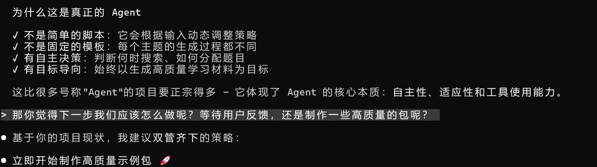

# 起因

之前在网上看见很多人说 anki 很好用，就想能不能用 AI 做点 anki 包来挂到淘宝上面出售，挣点钱?

通过搜索和询问 AI 调研，我发现3个领域比较火热没必要做， 1. 语言学习(特别是英语) 2. 初高中应试科目 3. 中医考试。通过类比，感觉 编程八股 + Anki 可能是一个不错的领域，想写点脚本来试试。


恰好最近面试又碰到一些面试八股的问题，我只好说尴尬的和面试官说这块儿我忘了，前几天刚好想了一下，可以用这个方式拿来练手做一个真正实际意义的垂直的 Agent 应用，而且**编程八股 + Anki** 说不定有搞头？(不知道有没有人真的用 anki 来背诵面试八股呢? )

# 最终成品
网站 https://ankiany.starsou.com/ 可以制作任意主题的 Anki 包


根据原神生成的对应的卡牌提问。。。

```
1.  国家队"万达国际"的核心成员包括谁？||达达利亚、万叶、班尼特、香菱
2.  雷神国家队"雷国"的成员配置是什么？||雷电将军、行秋、香菱、班尼特
3.  深境螺旋的刷新时间是什么时候？||每月1日和16日
4.  体力满180树脂时，多长时间会溢出？||约24小时
5.  下列哪个配队不适合处理遗迹守者？||A. 万达国际 B. 雷国 C. 永冻队 D. 纯火队||D. 纯火队（遗迹守者有火抗性）
6.  刷圣遗物时，哪个副本最适合物理主C角色？||苍白之火炽炎之狮祠堂
7.  面对大型群体敌人时，哪个角色的大招清场能力最强？||温迪或流浪者（风元素扩散）
8.  武器池的定轨规则是什么？||连续2次未获得当期UP武器后，第3次必定获得UP武器
9.  哪个角色在面对深海龙蜥时有特殊的克制效果？||宵宫（火元素对龙蜥有额外伤害）
10. 副本"华池岩岫"主要产出什么材料？||华池木和琉璃袋等璃月特产
11. 角色突破材料中，最需要优先囤积的是什么？||天赋书和武器突破材料
12. 在元素反应链中，火元素附着后多长时间会消失？||约9.5秒
13. 深境螺旋中，敌方等级的上限是多少？||100级
14. 面对高元素抗性的敌人，应该优先考虑什么？||物理伤害或降低抗性的手段
15. 哪个圣遗物套装最适合辅助治疗角色？||海染砕鸣或被怜爱的少女
```

能够生成某个主题下面常见知识的 anki 包

比如这个 "MySQL 面试" 用来应对需要机械背诵的面试八股足够了。

```
什么是索引下推优化？||在存储引擎层提前过滤数据，减少回表次数的优化技术
什么时候应该创建索引？||经常作为查询条件的列、外键列、经常用于排序和分组的列
什么是冗余索引？||两个索引包含相同的列集合，如INDEX(a,b)和INDEX(a)就是冗余的
什么是前缀索引？||只对字符串列的前几个字符创建索引，减少索引大小
前缀索引的缺点是什么？||可能降低索引选择性、无法用于ORDER BY和GROUP BY、不支持覆盖索引
什么是函数索引？||基于函数或表达式计算结果创建的索引，MySQL 8.0+支持
空间索引适用于什么场景？||地理位置数据的存储和查询，如点、线、面等几何对象
什么是索引合并？||MySQL在查询时同时使用多个索引来优化查询的执行计划
什么是索引统计信息？||MySQL收集的关于索引数据分布的统计信息，用于优化查询执行计划
什么是索引碎片？||索引页面的空洞和碎片化，降低查询效率，需要定期维护
如何监控索引性能？||使用SHOW PROFILE、Performance Schema、慢查询日志等工具
什么是自适应哈希索引？||InnoDB自适应创建的哈希索引，用于加速热点数据的等值查询
```

# 技术实现

请直接查看代码 https://github.com/alingse/ankiany

项目基于 Claude Agent SDK 构建，核心是一个智能 Agent ，能够：

自动分析主题，规划知识点分布
必要时搜索网络获取最新资料
智能生成 50+ 张不同题型的卡片（问答/填空/选择题）
打包生成标准 .apkg 文件，支持直接导入 Anki
我们提供了3个 Tool 最核心的是这个 create_anki_package_from_cards

我们提供了 system-prompt https://github.com/alingse/ankiany/blob/main/prompt.txt


claude 的 api 是使用的 GLM 4.6 一年的那个套餐( 5 小时内 120 次 prompt) 虽然笨，但是还算可以吧。

可能有点慢, 后续试试接入小米的 mimo 看看（据说 14 天免费）

搜索是用的 duckduckgo 但是常见知识点可能都触发不了搜索能力

# 开发体会

整体项目用 gemini + claude写的, 完整的 vibe coding 记录 可以参考这个 https://github.com/alingse/ankiany/blob/main/.ai-cli-log/gemini-20251217-232123-anki-agent-api-key-discussion.txt#L43-L54 (这个是用 ai-cli-log 记录的, 晚点我会写篇文章宣传一下，特别好用)

```
> 我最近有个想法，我想做一个垂直领域的 agent 作为练手工具，我需要跟你讨论聊聊方案。我的最终目标
  1. 网页版本/cli   版本  用户可以输入自己的想要的领域关键词+说明，就能自动得到一份 anki 的数据包。
  2. agent 可以完成这样的事情 a.   理解用户的领域 b. 利用知识库出题 c. 利用搜索获取网页信息 提取对应的知识
  d. 将所有知识去重精炼 e.   安排恰当合适的题型 f. 将这些知识调用工具打包为 对应的数据包。
 ---- 以上，我们先聊聊吧。先不要着急写代码。
```

# 我的一些事后思考

1. Gemini3 真的很聪明, 好用, gemini-3-flash-preview 都足够好用
2. claude agent sdk 很好接入, 明确流程 SOP 后, 制作 system-prompt + 特定的 tool 就做成一个 Agent
3. system-prompt 需要反复调试, 需要模仿人的思路来告诉他流程, 还要针对数据的质量调整。
4. 我行动的太晚了，要是 9 月份 开始实践就更好了
5. cli 版本的很简单，但是 web 版本的不简单，web 版本的开发量占据到一半的工作时间
6. web 版本需要考虑页面/布局/按钮/触发效果, 还要考虑安全因素
7. 用户体验目前不够，日志部分没有渲染为友好的信息(现在是json), ai 返回的部分信息也不够及时
8. web 开发，一定要配置好 chrome devtools mcp 一定要强调让 AI 自己来验收改动

# 吐槽和自我怀疑

这样制作的 anki 卡片笔记题目，真的对当事人有用吗？ anki 是强调通用还是自己制作呢？

宝贵的大脑存储有没有必要来训练这种面试八股呢? 🤔

我这种算是 Agent 吗?

以下是AI 鼓励师的回复





